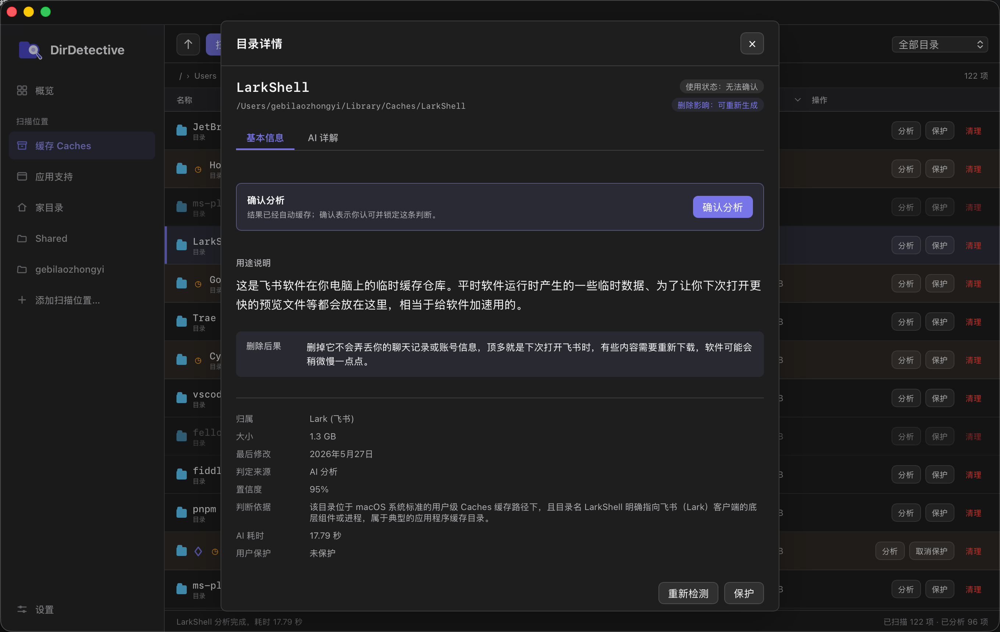
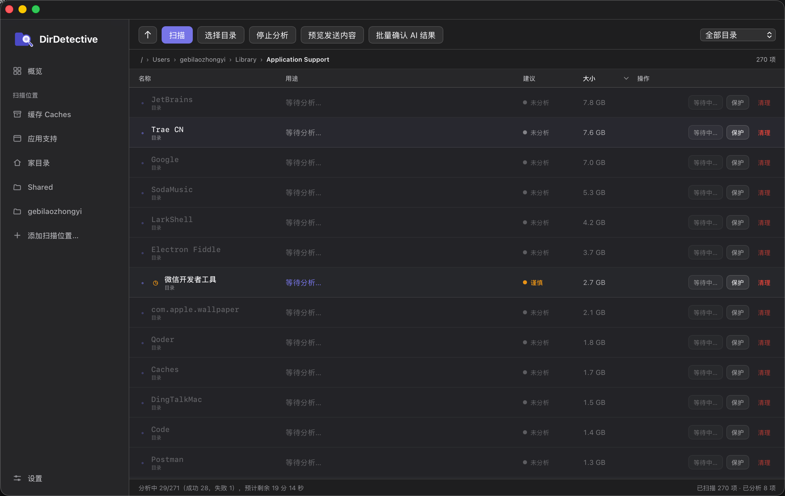
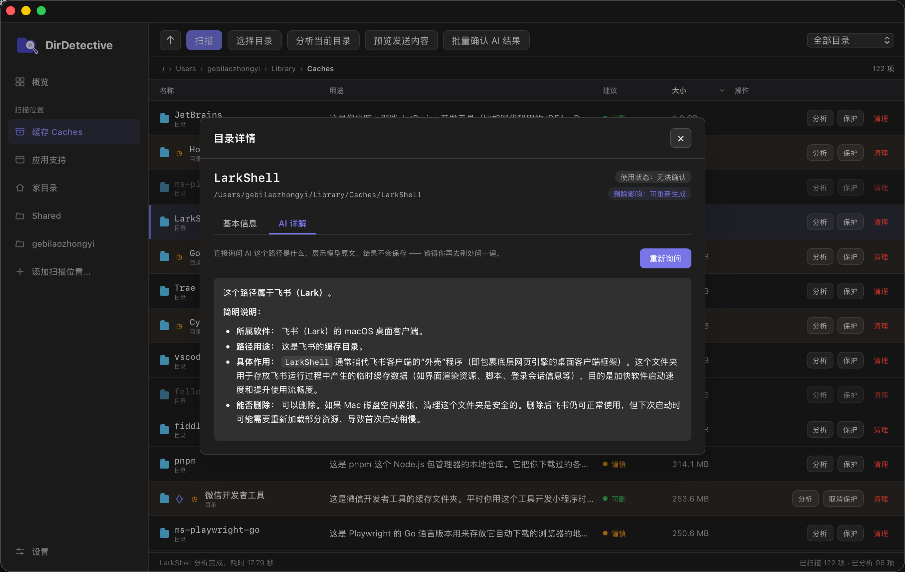
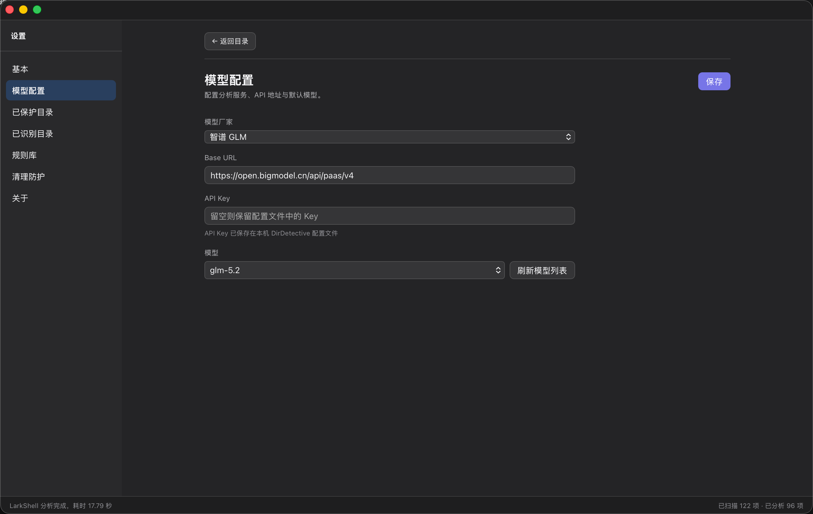
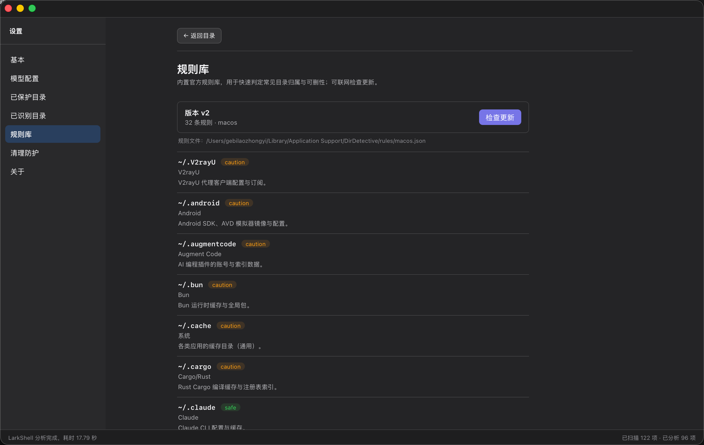
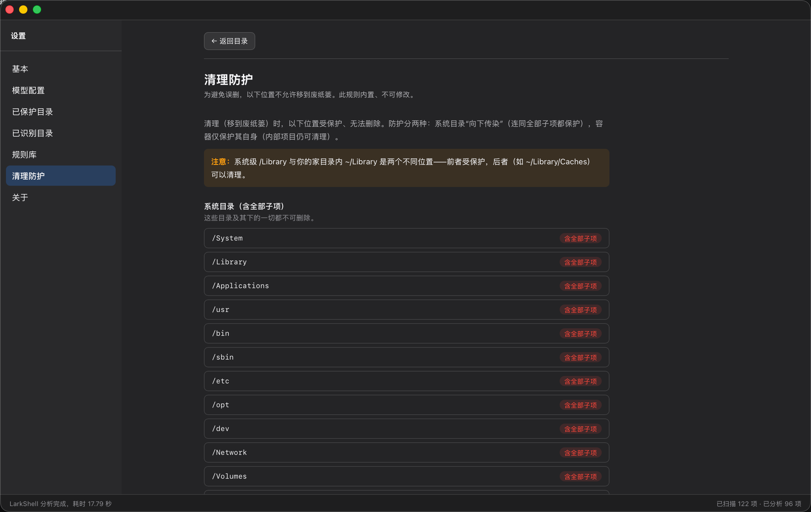
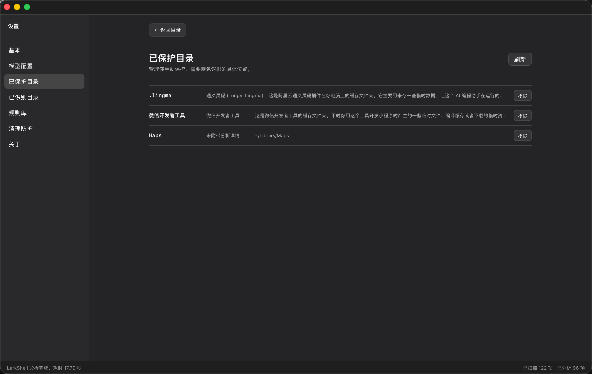
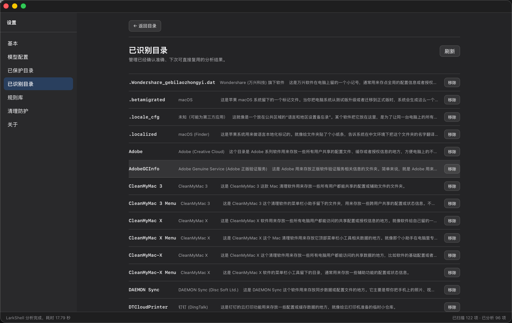
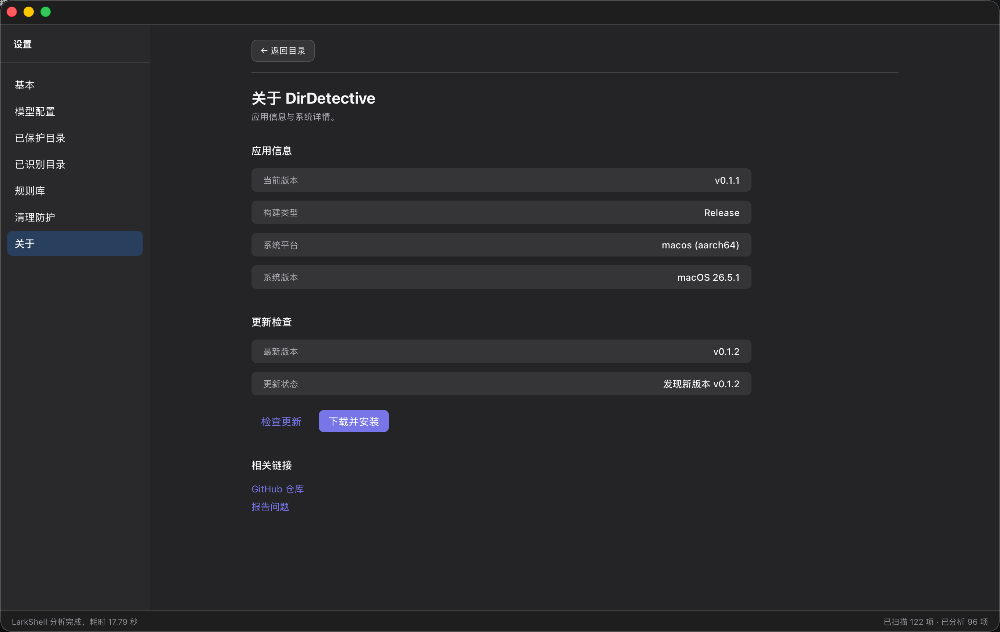
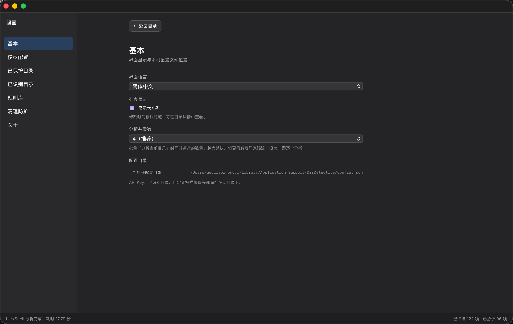

# DirDetective — Understand every folder before you decide to clean it up

**English** | [简体中文](./README.zh-CN.md)

> Feel like your disk keeps shrinking, but cleanup tools can't find what's taking it? Those are "zombie folders" hiding in the corners — but you don't dare delete them, afraid of breaking something.
>
> Disk cleaners only tell you *where* the space went. DirDetective tells you, for every folder, **whose it is, what it stores, and what happens if you delete it** — so you understand before you clean.

Built for developers and power users: your home folder, caches, and Application Support are full of cryptic hidden directories (`.augmentcode`, `.V2rayU`, `.dat.nosync`…) — you don't know which are still in use and which are leftovers from uninstalled apps. DirDetective judges each directory's **owner, purpose, and deletability**, then leaves the cleanup decision to you — instead of pasting each path into an AI one by one.

Currently a **macOS desktop app** (Tauri, Rust + WebView). Windows/Linux are planned.

<p align="center"></p>

---

## ✨ Features

- **Three-tier decision funnel**: built-in rule library (free, instant) → unknowns go to AI analysis → results cached locally, faster the more you use it
- **Per-directory concurrent analysis**: batch analysis with progress and ETA, stoppable at any time; one failure doesn't affect the rest
- **AI explanations**: ask the AI "what is this path?" right from the detail page, and read the model's raw answer
- **Safe cleanup**: move to Trash (recoverable); built-in "Cleanup Protection" blocks system / root / home folders themselves
- **Protect & Recognized**: manually protect key directories; lock in confirmed-accurate analyses for reuse
- **Updatable rule library**: official rules are maintained as "full path → verdict" JSON, with in-app online update checks — no need to wait for an app release
- **Multilingual**: 中文 / English, follows the system language, switchable in Settings
- **Privacy-first**: analyzes directory and file names only — **never reads file contents**

---

## 📸 Screenshots

<table>
  <tr>
    <td width="50%" align="center" valign="top"><br><b>Batch concurrent analysis</b><br>Progress / ETA / stop anytime</td>
    <td width="50%" align="center" valign="top"><br><b>Ask the AI on the spot</b><br>Ask "what is this path?" from the detail page</td>
  </tr>
</table>

**Settings panels**

<table>
  <tr>
    <td width="25%" align="center" valign="top"><br><b>Model config</b><br>Provider / Base URL / Key</td>
    <td width="25%" align="center" valign="top"><br><b>Official rule library</b><br>Online update check</td>
    <td width="25%" align="center" valign="top"><br><b>Cleanup protection</b><br>Blocks system / root / home</td>
    <td width="25%" align="center" valign="top"><br><b>Protected folders</b><br>Manually lock key folders</td>
  </tr>
  <tr>
    <td width="25%" align="center" valign="top"><br><b>Recognized folders</b><br>Reuse locked-accurate results</td>
    <td width="25%" align="center" valign="top"><br><b>About</b><br>Version / check for updates / GitHub</td>
    <td width="25%" align="center" valign="top"><br><b>Basic settings</b><br>Language / UI preferences</td>
    <td width="25%" align="center" valign="top"></td>
  </tr>
</table>

---

## 🚀 Getting started (for end users)

1. Download the latest macOS build from [Releases](https://github.com/gebilaoman/DirDetective/releases) (`.dmg` / `.app`) and drag it to **Applications**.
2. **First launch shows "damaged"?** This is macOS Gatekeeper blocking an unsigned app (it's not actually damaged; **the reason is there's no Apple Developer certificate yet, so the app isn't signed or notarized — hence this one-time manual step**). Run this once in Terminal:
   ```bash
   xattr -dr com.apple.quarantine /Applications/DirDetective.app
   ```
   Then open it normally.
3. **Configure AI (optional, used to analyze unknown directories)**: open the app → Settings → Model config, choose a provider (Zhipu GLM / OpenAI / DeepSeek / OpenRouter / a custom OpenAI-compatible service), fill in the Base URL, API Key, and model, then save.
   - Zhipu API Key: create one after registering at https://open.bigmodel.cn/
   - The key is stored only in the local config file (`~/Library/Application Support/DirDetective/config.json`).
4. **Start using it**: pick a scan location in the sidebar (Caches / Application Support / Home / custom), or click **Analyze with AI**, review each directory's owner and deletability, and **Clean up** to move it to Trash when you're ready.

> It works without an AI key too: the built-in rule library judges common directories directly; only unknowns need the AI.

---

## 🛠 Build from source / develop

### Prerequisites
- [Rust](https://rustup.rs/) (stable)
- [Node.js](https://nodejs.org/) 20+
- [pnpm](https://pnpm.io/) 9+
- macOS: Xcode Command Line Tools (`xcode-select --install`)

### Dev mode (hot reload)
```bash
git clone https://github.com/gebilaoman/DirDetective.git
cd DirDetective/code/DirDetective/gui
pnpm install
pnpm tauri dev
```
Frontend changes (`gui/main.js`, `index.html`, `styles.css`) hot-reload; Rust changes (`crates/*`, `gui/src-tauri`) auto-rebuild.

### Packaging
```bash
cd gui
pnpm tauri build            # output in gui/src-tauri/target/release/bundle/
pnpm tauri:build:signed     # with updater signature (needs local gui/.env.secret key)
```

### Bundled experimental CLI
```bash
cargo run -p dirdetective -- scan
```

### Project structure
```
code/DirDetective/
├── crates/
│   ├── core/         # platform-agnostic: Scanner / RuleEngine / AIProvider / Models
│   ├── platform/     # evidence gathering (installed apps / packages / extensions)
│   └── cli/          # experimental CLI entry
├── gui/              # Tauri desktop app (frontend + src-tauri backend)
└── rules/            # official rule library (per-platform files, see below)
```

---

## 🔒 Privacy & security

- **Uploads metadata only, never file contents**: directory names, sampled file names, sizes, modification times, and the list of installed apps / packages / extensions on your machine.
- **Path anonymization**: the home-folder prefix is replaced with `~` before being sent to the AI.
- **Cleanup Protection** (Settings → Cleanup Protection): system directories (`/System`, `/Library`, `/usr`…), the root directory, the home folder itself, and its ancestors can never be deleted; only specific items outside these can be cleaned.
- **Recoverable**: cleanup only moves to Trash and is always undoable.

---

## 📚 Rule library

The official rule library is maintained as "**full path → verdict**" JSON (same shape as the local cache), split by platform: `rules/macos.json` (Windows/Linux planned).

```jsonc
{
  "version": 1,
  "rules": {
    "~/.your-tool": {
      "owner": "Your Tool",
      "purpose": "Local cache for Your Tool",
      "deletable": "safe",           // safe / caution / never / unknown
      "delete_effect": "Regenerates after deletion"
    }
  }
}
```

**Contributing rules**: edit `rules/macos.json` to add entries → bump the `version` at the top → `cargo test -p dirdetective-core` passes → open a PR.
Once merged and published, users can pull it via **Settings → Rule library → Check for updates** without updating the app.

---

## 🗺 Roadmap

| Version | Scope |
|---|---|
| v0.1 | ✅ Desktop app (scan / rule + AI analysis / cache / cleanup / settings) |
| v0.1.x | ✅ Path-keyed JSON rule library + online updates, i18n framework, updater |
| **v0.2** | 🚧 Full i18n (dynamic copy + backend messages), rule library expansion (in progress) |
| Later | Windows / Linux support, community rule dictionary, Apple signing & notarization |

---

## 🤝 Contributing

Contributions to the rule library (see above), bug reports, suggestions, and PRs are all welcome.

## License

[MIT](LICENSE)
